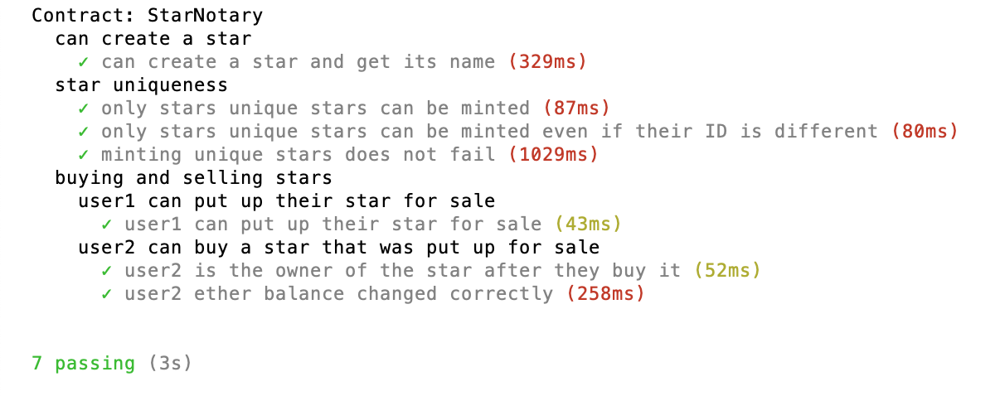

 
 


# Project 5 - Decentralized Star Notary

Welcome to Project 5: Decentralized Star Notary

For this project, you will create a DApp by adding functionality to your smart contract and deploy it on the public testnet. To do so, you'll employ your blockchain identity to secure digital assets on the Ethereum platform using a smart contract. You will get to practice your knowledge of the basics of Solidity.

Previously, you learned to create your own private blockchain web service. In this course, you migrated your private blockchain functionality to a smart contract and created your own ERC721 non-fungible token contract!

## Contract on Rinkeby Test Network

- Contract address: (`0x4b54e06131884604cc75501bfc30b44e0d0d70f9`)
- Contract creation transaction: (`0x4b04e56feb79fbd8493056cfb1ecae5ce64d1511696b3caf0f20be5dfe2077a3`)
- <a href="https://rinkeby.etherscan.io/tx/0x4b04e56feb79fbd8493056cfb1ecae5ce64d1511696b3caf0f20be5dfe2077a3">URL on Etherscan of contract creation transaction</a>
- <a href="https://rinkeby.etherscan.io/address/0x4b54e06131884604cc75501bfc30b44e0d0d70f9">Contract page on Etherscan</a>

## Getting Started

These instructions will get you a copy of the project. You can follow below instructions to start making connection with Smart Contract on rinkeby network:

1. Download or clone this repo to a local folder on your machine
    - git clone https://github.com/raheel78/Blockchain-Nanodegree-Project5.git
2. Open terminal (MAC/linux) or command prompt (windows variants) on your desktop
3. Run `npm install` to install dependencies from package.json
4. Run any JS server (http-server) or simply node client
    - http-server (open browser and point to http://127.0.0.1:8080)
    - node index.html
5. This will open the index.html in your browser and if all goes smooth then you should a page as shown below:


## Prerequisites

You need to have setup following frameworks on your machine before running this project:

```
- "truffle-hdwallet-provider": "0.0.6"
```

Also your chrome browser must have Metamask extension installed with rinkeby account setup with some ethers in it.


## Running the tests

You can run automated tests through `truffle` from your command line, as shown below:

1. Make sure you are at root path of the cloned folder
2. Also, make sure that some local ethereum client (such as; ganache GUI or ganache-cli) must be running on your local PC
3. Change directory to `smart_contracts` folder (e.g. cd smart_contracts)
4. Run command:  `truffle test test/StarNotaryTest.js`
5. Successful test execution should look something like below:




